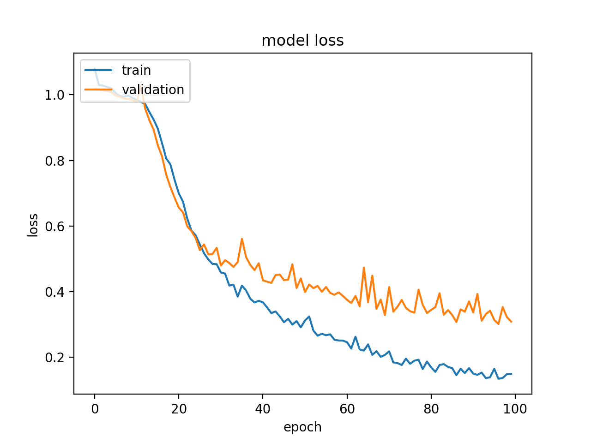

Author: Richa Sharma  
email: rbsharma@sdsu.edu

<h2>Usage</h2>
python Richa_Sharma_LSTM_RNN_Model_Machine_Learning_Final.py

<h2>Preprocessing of data for LSTM RNN </h2> 
To prepare the data for the LSTM model, the DNA sequence samples were first extracted from the splice data file, shuffled and converted into a string of integers using the following scheme:A':1, 'T':2, 'G':3, 'C':4, 'D':5, 'N':6, 'S':7, 'R':8. Next, we defined a parameter called kmers(length = k). Basically, we divided each DNA sequence, in to a series of words of length k and obtained a specific number of kmers. Since, the input for the model is an array, we converted these strings into an array, whose shape was determined by length of the kmers specified. Thus, the data array was obtained with a shape of (samples, number of kmers, kmer length). 
Similarly, the corresponding classification label EI, IE or N for each sample was extracted from the splice data and converted in to a vector using the following scheme:EI': 0, 'IE': 1, 'N': 2. The shape of the labels vector obtained is (samples, 1).
Splitting Data into training and test sets:
The data array and the label vector was divided into training and test sets to train and check the performance of the model respectively. The data as mentioned before is  shuffled and randomized at the time of extraction from the data file. Hence, we have shuffled data for our training and test sets. The data was divided in 80:20 ratio for training and test data. Hence, our training set has 2552 samples and the test data has 638 samples. 

<h2>Input data shape for LSTM RNN</h2> 
The shape of the input data for the LSTM RNN model is defined in the first hidden layer the model, using the argument “input_shape”. An LSTM layer requires a 3-D array of input data with the following dimensions- Samples, time-steps and features. The argument input_shape accepts a tuple indicating the time steps and the features. The number of samples are assumed to be one or more. When the input shape for our training data is (2552,12,5), where 2552 are the number of samples, 12 is the number of time steps and 5 is the size of the kmers which is  the number of features at each time time step. 

<h2>Design of the LSTM RNN model</h2> 
The LSTM RNN model was built from scratch using the Keras API with TensorFlow at backend. Our model is composed of 4 layers as follows: 2 hidden LSTM layers and 2 dense layers. The first LSTM layer has 16 nodes and the second LSTM layer has 32 nodes. The activation functions for the first and the second layers are tanh and sigmoid respectively. The next layer is a dense layer with 8 nodes and sigmoid activation function. The final output dense layer has 3 nodes with softmax activation function. To begin compiling our model, we used the adam optimizing algorithm, to update the network weights. The learning rate we selected for the optimizer is 3e-3. We used the loss function sparse categorical cross entropy to penalize a wrong output. The metrics argument for the compile function was set to accuracy, since the appropriate accuracy function is determined according to the loss function used. In our case thus, sparse categorical accuracy is used. We tested our model with different lengths of kmers(3, 5 and 6) for 50 epochs each, to determine the kmer length at which we get best accuracy for our model. Once the best kmer length was determined we ran the model for 100 epochs to analyze its performance.

<h2>Results</h2> 
<b>Loss v/s Epochs</b>

